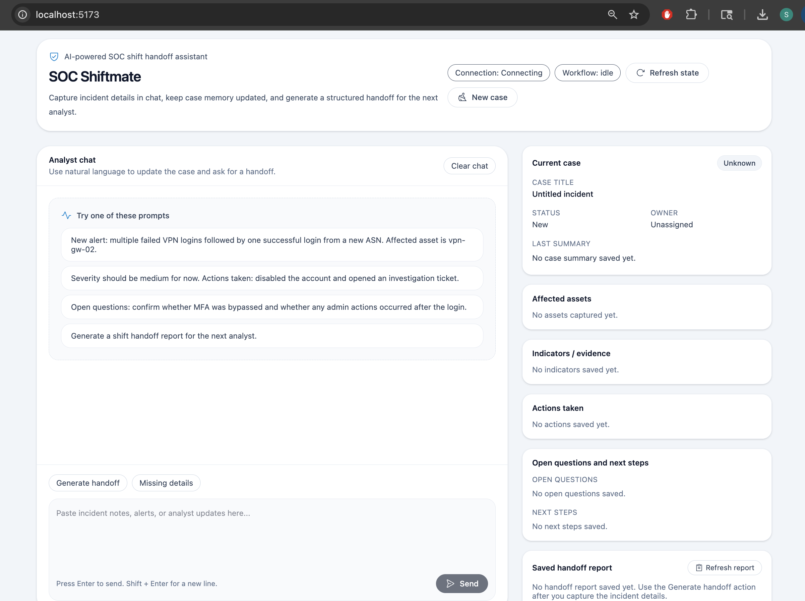

# cf_ai_soc_shiftmate

**SOC Shiftmate** is an AI-powered SOC shift handoff assistant built on Cloudflare. It helps Security Operations Center (SOC) analysts capture incident details in chat, maintain structured case memory, and generate a clean handoff report for the next analyst.

---

## Project Overview

SOC analysts work in shifts, and shift handoffs are often rushed, inconsistent, and error-prone. When one analyst’s shift ends, they need to brief the next analyst on every active incident: what happened, what actions were taken, what is still unknown, and what needs to happen next.

In many teams, this process is still done manually by copying notes, filling templates, or writing summaries under time pressure. As a result, important details can be missed and incident context can get lost between shifts.

**SOC Shiftmate** solves this by letting analysts work naturally through chat. Instead of filling out a rigid form, the analyst can paste alert text, add investigation notes, update severity, record actions taken, and list open questions in plain language.

Behind the scenes, the AI:

- extracts structured incident details from freeform chat
- stores them as persistent case state
- keeps a live case panel updated in the UI
- generates a structured Markdown handoff report on demand

---

## The Problem It Solves

SOC handoffs are a real operational pain point.

A typical outgoing analyst must communicate:

- what the incident is
- which assets are affected
- what indicators were seen
- what actions have already been taken
- what still needs investigation
- what the next analyst should do next

When this is done manually, handoffs can become incomplete, inconsistent, or hard to follow. That slows investigations and increases the chance that key context will be lost.

SOC Shiftmate is designed to reduce that friction by turning natural-language analyst notes into structured incident memory and handoff-ready summaries.

---

## How It Works

SOC Shiftmate uses a chat-based workflow.

1. The analyst types or pastes incident updates into chat.
2. The app extracts structured case details such as:
   - case title
   - severity
   - status
   - affected assets
   - indicators
   - actions taken
   - open questions
   - next steps
3. The extracted information is stored in persistent case state.
4. The right-side case panel updates live so the analyst can immediately see what has been captured.
5. When requested, the app generates a structured handoff report for the next analyst.

---

## Example Use Case

An analyst might paste a message like:

> New alert: multiple failed VPN logins were followed by one successful login from a new ASN. Affected asset is vpn-gw-02.

SOC Shiftmate can then:
- capture the affected asset
- preserve the incident context
- track follow-up updates such as severity, indicators, and actions taken
- generate a handoff report once the analyst is ready

---

## Assignment Requirements Mapping

This project was built to satisfy the Cloudflare AI app assignment requirements.

### LLM
The application uses **Workers AI** for structured extraction, analyst-facing responses, and handoff report generation.

### Workflow / Coordination
The application coordinates multiple AI-driven steps in the backend:
- extracting structured case data from chat
- updating persistent case state
- generating a handoff report from the saved case snapshot

### User Input
The application uses a **chat interface** as the primary user input method.

### Memory / State
The application maintains **persistent case memory/state** so the conversation and incident details can be preserved and reused across interactions.

---

## Architecture

### Frontend
- React-based chat UI
- live case panel for structured incident state
- handoff report display section

### Backend
- Cloudflare Agent backend
- persistent case state management
- AI-powered extraction and handoff generation

### AI Behavior
- extract structured incident facts from freeform chat
- maintain case memory
- generate concise analyst-ready handoff reports

---

## Tech Stack

- **Cloudflare Agents**
- **Cloudflare Workers AI**
- **React**
- **TypeScript**
- **Vite**
- **Wrangler**
- **Zod**

---

## Key Features

- Chat-based incident intake
- Structured case memory
- Live case panel
- Severity, status, assets, indicators, actions, questions, and next steps tracking
- On-demand Markdown handoff generation
- SOC-focused workflow and language

---

## Screenshots

Add a screenshot of the app here.

Example:

```md
